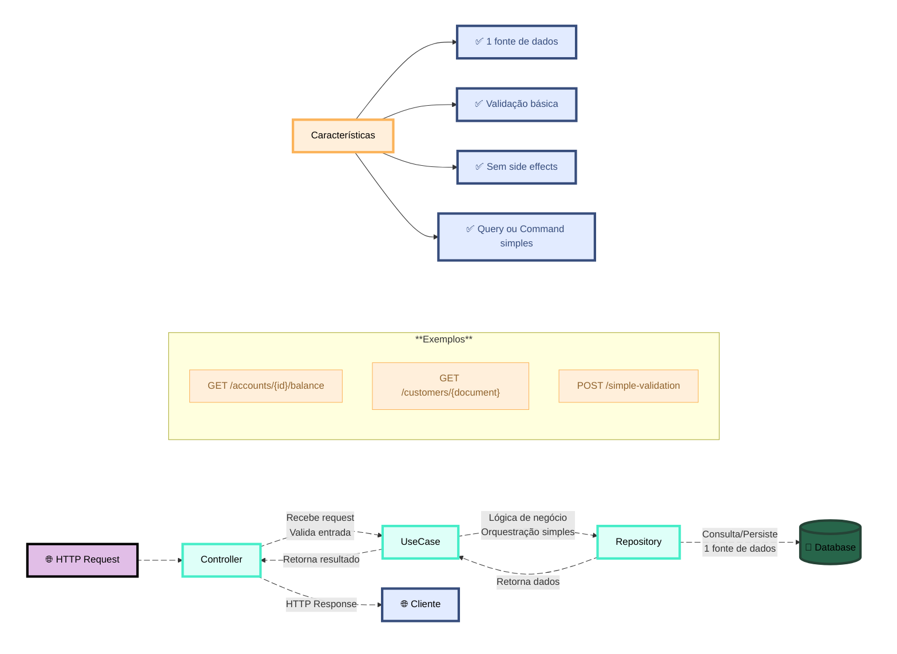
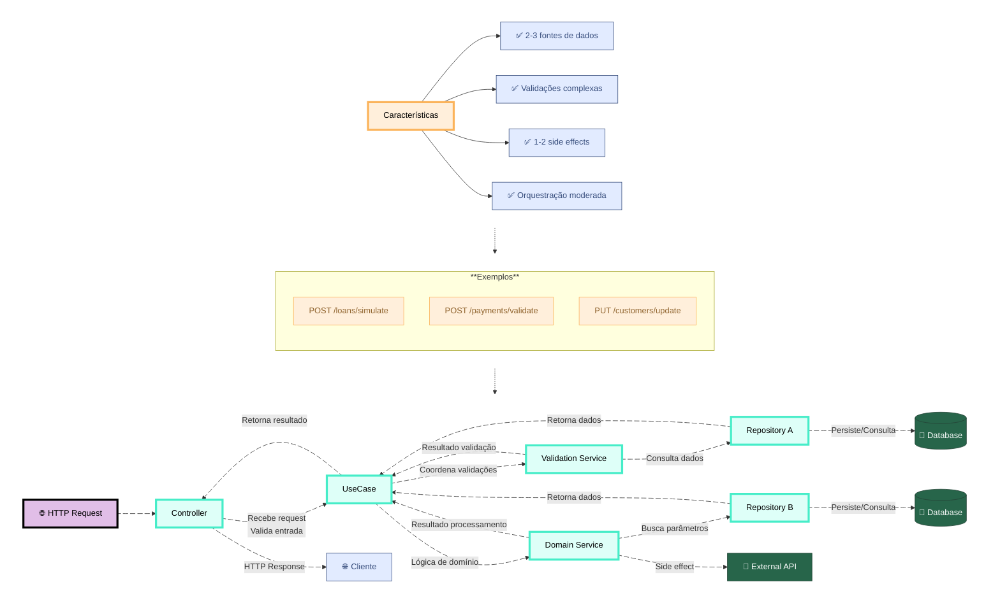
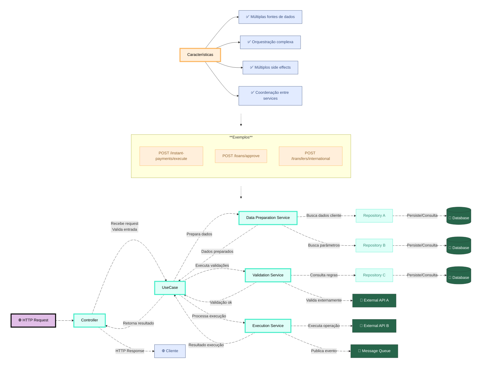
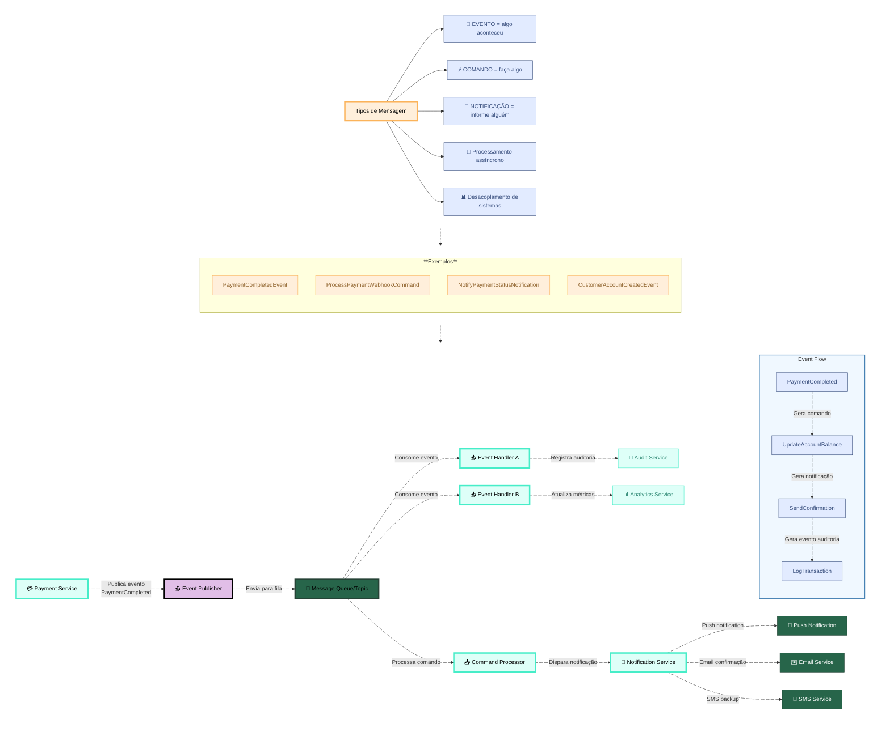

# software-architecture-guide

Guia prático de sugestão de arquitetura ( NÃO SÃO MANDAMENTOS ESCRITOS EM PEDRA )

## Índice

1. [Análise inicial](#1-análise-inicial---o-que-estou-construindo)
2. [Estruturas por complexidade](#2-estrutura-por-complexidade)
3. [Decisão: quando criar cada camada](#3-decisão-quando-criar-cada-camada)
4. [Framework de integrações](#4-framework-de-integrações)
5. [Templates por cenário](#5-templates-por-cenário)
6. [Framework de nomenclatura](#6-framework-de-nomenclatura)
7. [Exemplos práticos](#7-exemplos-práticos)
8. [Checklist de validação](#8-checklist-de-validação)
9. [Patterns específicos](#9-patterns-específicos)
10. [Regras finais](#10-regras-finais)

    

## 1. ANÁLISE INICIAL - "O QUE ESTOU CONSTRUINDO?"

### Passo 1A: Identifique o Tipo de Operação
- [ ] É uma consulta (query)? → Caminho mais simples
- [ ] É uma operação (command)? → Caminho mais complexo  
- [ ] É um processamento assíncrono? → Mensageria
- [ ] É integração externa? → Gateway/Adapter pattern

### Passo 1B: Identifique a Complexidade
- **SIMPLES** = 1 fonte de dados + validação básica + sem side effects
- **MÉDIA** = 2-3 fontes + validações + 1-2 side effects  
- **COMPLEXA** = múltiplas fontes + orquestração + múltiplos side effects
- **CRÍTICA** = tudo acima + compensação + auditoria + compliance


## 2. ESTRUTURA POR COMPLEXIDADE

### Nível SIMPLES
```python
# Estrutura: Rota → UseCase → Repository
GET /accounts/{document}

class GetCustomerAccountsUseCase:
    def __init__(self, account_repo: AccountRepository):
        self._account_repo = account_repo
    
    async def execute(self, document: str) -> List[Account]:
        return await self._account_repo.find_by_document(document)

# SEM services intermediários - direto pro repository
```



### Nível MÉDIA
```python
# Estrutura: Rota → UseCase → Repository + Cache(se aplicavel)
POST /instant-payment/simulate

class SimulateInstantLoanUseCase:
    def __init__(self, 
                 account_repo: AccountRepository,
                 credit_params_repo: CreditParametersRepository,
                 loan_calculator: LoanCalculator):
    
    async def execute(self, cmd: SimulateCommand) -> SimulationResult:
        # Busca dados
        account = await self._account_repo.find_by_id(cmd.account_id)
        params = await self._credit_params_repo.get_by_account_id(cmd.account_id)
        
        # Processa (service/domain)
        return self._loan_calculator.calculate(account, params, cmd.amount)

# Use case orquestra, mas sem services intermediários
```



### Nível COMPLEXA
```python
# Estrutura: Rota → UseCase → Multiple Services → Multiple Repos + External
POST /instant-payment/execute

class ExecuteInstantPaymentUseCase:
    def __init__(self, 
                 data_service: PaymentDataPreparationService,
                 validation_service: PaymentValidationService, 
                 execution_service: PaymentExecutionService):
                 
    async def execute(self, cmd: InstantPaymentCommand):
        data = await self._data_service.prepare(cmd)
        await self._validation_service.validate(cmd, data)  
        return await self._execution_service.process(cmd, data)

# Use case coordena services, services coordenam repositories
```



```mermaid
---
config:
  theme: mc
  look: classic
  layout: dagre
---
flowchart TD
    subgraph TOP[" "]
        G["Características"]
        H["✅ Tudo da complexa +"]
        I["✅ Compensação automática"]
        J["✅ Auditoria obrigatória"]
        K["✅ Compliance rigoroso"]
        L["✅ Circuit breakers"]
    end
    
    subgraph Exemplos["**Exemplos**"]
        M["POST /open-banking/consents"]
        N["POST /international-transfers"]
        O["POST /credit-approvals"]
        P["POST /regulatory-reports"]
    end
    
    subgraph MIDDLE[" "]
        Exemplos
    end
    
    subgraph BOTTOM[" "]
        A["🌐 HTTP Request"]
        B["Controller"]
        C["UseCase"]
        D["Data Preparation Service"]
        E["Validation Service"]
        F["Execution Service"]
        G2["Compensation Service"]
        H2["Audit Service"]
        I2["Compliance Service"]
        J2["Repository A"]
        K2["Repository B"]
        L2["Repository C"]
        M2[("💾 Database A")]
        N2[("💾 Database B")]
        O2[("💾 Database C")]
        P2[("📋 Audit Log")]
        Q2["📧 External API A"]
        R2["📧 External API B"]
        S2["🔔 Message Queue"]
        T2["⚡ Circuit Breaker"]
        U2["🌐 Cliente"]
    end
    
    G --> H & I & J & K & L
    A L_A_B_0@--> B
    B L_B_C_0@-- "Recebe request<br>Valida entrada" --> C
    C L_C_H2_0@-- "Inicia auditoria" --> H2
    C L_C_I2_0@-- "Valida compliance" --> I2
    C L_C_D_0@-- "Prepara dados" --> D
    C L_C_E_0@-- "Executa validações" --> E
    C L_C_F_0@-- "Processa execução" --> F
    
    D L_D_J2_0@-- "Busca dados cliente" --> J2
    D L_D_K2_0@-- "Busca parâmetros" --> K2
    E L_E_L2_0@-- "Consulta regras" --> L2
    E L_E_T2_0@-- "Valida com proteção" --> T2
    T2 L_T2_Q2_0@-- "Circuit breaker" --> Q2
    F L_F_R2_0@-- "Executa operação" --> R2
    F L_F_S2_0@-- "Publica evento" --> S2
    
    J2 L_J2_M2_0@-- "Persiste/Consulta" --> M2
    K2 L_K2_N2_0@-- "Persiste/Consulta" --> N2
    L2 L_L2_O2_0@-- "Persiste/Consulta" --> O2
    H2 L_H2_P2_0@-- "Registra auditoria" --> P2
    
    F L_F_G2_0@-- "Se falhar" --> G2
    G2 L_G2_F_0@-- "Compensa transação" --> F
    
    D L_D_C_0@-- "Dados preparados" --> C
    E L_E_C_0@-- "Validação ok" --> C
    F L_F_C_0@-- "Resultado execução" --> C
    H2 L_H2_C_0@-- "Auditoria registrada" --> C
    I2 L_I2_C_0@-- "Compliance ok" --> C
    C L_C_B_0@-- "Retorna resultado" --> B
    B L_B_U2_0@-- "HTTP Response" --> U2
    
    TOP -.-> MIDDLE
    MIDDLE -.-> BOTTOM
    
    G:::Peach
    H:::Sky
    I:::Sky
    J:::Sky
    K:::Sky
    L:::Sky
    M:::Peach
    N:::Peach
    O:::Peach
    P:::Peach
    A:::Sky
    B:::Aqua
    C:::Aqua
    D:::Aqua
    E:::Aqua
    F:::Aqua
    G2:::Aqua
    H2:::Aqua
    I2:::Aqua
    J2:::Aqua
    K2:::Aqua
    L2:::Aqua
    M2:::Pine
    N2:::Pine
    O2:::Pine
    P2:::Pine
    Q2:::Pine
    R2:::Pine
    S2:::Pine
    T2:::Pine
    U2:::Sky
    
    classDef Peach stroke-width:1px, stroke-dasharray:none, stroke:#FBB35A, fill:#FFEFDB, color:#8F632D
    classDef Pine stroke-width:1px, stroke-dasharray:none, stroke:#254336, fill:#27654A, color:#FFFFFF
    classDef Sky stroke-width:1px, stroke-dasharray:none, stroke:#374D7C, fill:#E2EBFF, color:#374D7C
    classDef Aqua stroke-width:1px, stroke-dasharray:none, stroke:#46EDC8, fill:#DEFFF8, color:#378E7A
    
    style G stroke-width:4px,stroke-dasharray: 0,color:#000000
    style A stroke-width:4px,stroke-dasharray: 0,stroke:#000000,fill:#E1BEE7,color:#000000
    style B stroke-width:4px,stroke-dasharray: 0,color:#000000
    style C stroke-width:4px,stroke-dasharray: 0,color:#000000
    style D stroke-width:4px,stroke-dasharray: 0,color:#000000
    style E stroke-width:4px,stroke-dasharray: 0,color:#000000
    style F stroke-width:4px,stroke-dasharray: 0,color:#000000
    style G2 stroke-width:4px,stroke-dasharray: 0,color:#000000
    style H2 stroke-width:4px,stroke-dasharray: 0,color:#000000
    style I2 stroke-width:4px,stroke-dasharray: 0,color:#000000
    style TOP fill:none,stroke:none
    style MIDDLE fill:none,stroke:none
    style BOTTOM fill:none,stroke:none
    
    L_A_B_0@{ animation: slow }
    L_B_C_0@{ animation: slow }
    L_C_H2_0@{ animation: slow }
    L_C_I2_0@{ animation: slow }
    L_C_D_0@{ animation: slow }
    L_C_E_0@{ animation: slow }
    L_C_F_0@{ animation: slow }
    L_D_J2_0@{ animation: slow }
    L_D_K2_0@{ animation: slow }
    L_E_L2_0@{ animation: slow }
    L_E_T2_0@{ animation: slow }
    L_T2_Q2_0@{ animation: slow }
    L_F_R2_0@{ animation: slow }
    L_F_S2_0@{ animation: slow }
    L_J2_M2_0@{ animation: slow }
    L_K2_N2_0@{ animation: slow }
    L_L2_O2_0@{ animation: slow }
    L_H2_P2_0@{ animation: slow }
    L_F_G2_0@{ animation: slow }
    L_G2_F_0@{ animation: slow }
    L_D_C_0@{ animation: slow }
    L_E_C_0@{ animation: slow }
    L_F_C_0@{ animation: slow }
    L_H2_C_0@{ animation: slow }
    L_I2_C_0@{ animation: slow }
    L_C_B_0@{ animation: slow }
    L_B_U2_0@{ animation: slow }
``
## 3. DECISÃO: QUANDO CRIAR CADA CAMADA

### Service Layer - Quando Criar
**✅ CRIE Service quando:**
- [ ] Precisa coordenar 2+ repositories
- [ ] Tem lógica de orquestração media ou complexa  
- [ ] Precisa fazer calls externos + internos
- [ ] Tem transações distribuídas
- [ ] Precisa de retry/circuit breaker

**❌ NÃO crie Service quando:**
- [ ] É só buscar dados e retornar
- [ ] É validação simples
- [ ] É cálculo direto sem side effects

### Repository - Quando Separar
**✅ SEPARE Repository quando:**
- [ ] Agregados de domínio diferentes
- [ ] Ciclos de vida independentes
- [ ] Fontes de dados diferentes
- [ ] Padrões de acesso diferentes

**✅ MANTENHA JUNTO quando:**
- [ ] Sempre acessados juntos
- [ ] Forte acoplamento de dados  
- [ ] Mesma transação sempre
- [ ] Mesmo bounded context

## 4. FRAMEWORK DE INTEGRAÇÕES

### APIs Internas (Microserviços)
```python
# Padrão: Gateway + Adapter
class IPaymentGateway:  # Interface
    async def create_payment_order() -> PaymentResult

class BankPaymentGateway(IPaymentGateway):  # Implementação
    def __init__(self, http_client: HttpClient, config: BankConfig)
    
# Use Case usa Gateway (abstração)
# Não conhece implementação específica
```

### APIs de Terceiros
```python
# Padrão: External Service + Circuit Breaker
class InstantPaymentKeyService:
    def __init__(self, 
                 central_bank_client: CentralBankClient,
                 circuit_breaker: CircuitBreaker,
                 cache: RedisClient):
                 
    async def get_payment_key_info(self, key: str):
        # Circuit breaker + cache(se aplicavel) + retry
        return await self._central_bank_client.get_key_info(key)
```


```mermaid
---
config:
  theme: mc
  look: classic
  layout: dagre
---
flowchart TD
    subgraph TOP[" "]
        G["Características"]
        H["✅ Abstração de APIs externas"]
        I["✅ Circuit breaker + retry"]
        J["✅ Cache quando aplicável"]
        K["✅ Isolamento de dependências"]
        L["✅ Testabilidade"]
    end
    
    subgraph Exemplos["**Exemplos**"]
        M["BankPaymentGateway"]
        N["CentralBankKeyService"]
        O["CreditScoreGateway"]
        P["NotificationGateway"]
    end
    
    subgraph MIDDLE[" "]
        Exemplos
    end
    
    subgraph BOTTOM[" "]
        A["UseCase"]
        B["🔌 IPaymentGateway<br/>(Interface)"]
        C["Gateway Implementation"]
        D["🛡️ Circuit Breaker"]
        E["🔄 Retry Logic"]
        F["💾 Cache Layer"]
        G2["📧 External API"]
        H2["⚠️ Fallback Service"]
        I2["📊 Metrics & Monitoring"]
        
        subgraph Adapter["Adapter Pattern"]
            J2["External Response"]
            K2["Response Mapper"]
            L2["Domain Model"]
        end
    end
    
    G --> H & I & J & K & L
    A L_A_B_0@-- "Usa abstração<br/>Não conhece implementação" --> B
    B L_B_C_0@-- "Implementação específica" --> C
    C L_C_D_0@-- "Proteção contra falhas" --> D
    D L_D_E_0@-- "Tentativas automáticas" --> E
    E L_E_F_0@-- "Cache se aplicável" --> F
    F L_F_G2_0@-- "Chamada externa" --> G2
    
    D L_D_H2_0@-- "Se circuit aberto" --> H2
    C L_C_I2_0@-- "Coleta métricas" --> I2
    
    G2 L_G2_J2_0@-- "Resposta externa" --> J2
    J2 L_J2_K2_0@-- "Converte formato" --> K2
    K2 L_K2_L2_0@-- "Para domínio" --> L2
    L2 L_L2_A_0@-- "Retorna modelo" --> A
    
    H2 L_H2_A_0@-- "Resposta degradada" --> A
    
    TOP -.-> MIDDLE
    MIDDLE -.-> BOTTOM
    
    G:::Peach
    H:::Sky
    I:::Sky
    J:::Sky
    K:::Sky
    L:::Sky
    M:::Peach
    N:::Peach
    O:::Peach
    P:::Peach
    A:::Aqua
    B:::Aqua
    C:::Aqua
    D:::Pine
    E:::Pine
    F:::Pine
    G2:::Pine
    H2:::Pine
    I2:::Pine
    J2:::Sky
    K2:::Sky
    L2:::Sky
    
    classDef Peach stroke-width:1px, stroke-dasharray:none, stroke:#FBB35A, fill:#FFEFDB, color:#8F632D
    classDef Pine stroke-width:1px, stroke-dasharray:none, stroke:#254336, fill:#27654A, color:#FFFFFF
    classDef Sky stroke-width:1px, stroke-dasharray:none, stroke:#374D7C, fill:#E2EBFF, color:#374D7C
    classDef Aqua stroke-width:1px, stroke-dasharray:none, stroke:#46EDC8, fill:#DEFFF8, color:#378E7A
    
    style G stroke-width:4px,stroke-dasharray: 0,color:#000000
    style A stroke-width:4px,stroke-dasharray: 0,color:#000000
    style B stroke-width:4px,stroke-dasharray: 0,stroke:#000000,fill:#E1BEE7,color:#000000
    style C stroke-width:4px,stroke-dasharray: 0,color:#000000
    style D stroke-width:4px,stroke-dasharray: 0,color:#000000
    style E stroke-width:4px,stroke-dasharray: 0,color:#000000
    style F stroke-width:4px,stroke-dasharray: 0,color:#000000
    style G2 stroke-width:4px,stroke-dasharray: 0,color:#000000
    style H2 stroke-width:4px,stroke-dasharray: 0,color:#000000
    style I2 stroke-width:4px,stroke-dasharray: 0,color:#000000
    style TOP fill:none,stroke:none
    style MIDDLE fill:none,stroke:none
    style BOTTOM fill:none,stroke:none
    style Adapter fill:#f9f9f9,stroke:#ddd,stroke-width:2px
    
    L_A_B_0@{ animation: slow }
    L_B_C_0@{ animation: slow }
    L_C_D_0@{ animation: slow }
    L_D_E_0@{ animation: slow }
    L_E_F_0@{ animation: slow }
    L_F_G2_0@{ animation: slow }
    L_D_H2_0@{ animation: slow }
    L_C_I2_0@{ animation: slow }
    L_G2_J2_0@{ animation: slow }
    L_J2_K2_0@{ animation: slow }
    L_K2_L2_0@{ animation: slow }
    L_L2_A_0@{ animation: slow }
    L_H2_A_0@{ animation: slow }
```

### Redis (Cache/Session)
```python
# Decisão por tipo de dado:
CACHE_LOOKUP     = dados que não mudam frequentemente
SESSION_DATA     = dados da sessão do usuário  
DISTRIBUTED_LOCK = coordenação entre instâncias
RATE_LIMITING    = controle de taxa

class PaymentKeyLookupCache:  # Cache específico
    async def get_cached_key_info(self, key: str) -> Optional[PaymentKeyInfo]
    async def cache_key_info(self, key: str, info: PaymentKeyInfo, ttl: int)
```

### Mensageria (Eventos/Comandos)
```python
# Padrão por tipo:
EVENTO       = algo aconteceu (PaymentCompleted)
COMANDO      = faça algo (ProcessPaymentWebhook) 
NOTIFICAÇÃO  = informe algo/alguém (NotifyPaymentStatus)

class InstantPaymentEventPublisher:
    async def publish_payment_completed(self, event: PaymentCompletedEvent)
    
class WebhookEventProcessor:
    async def handle_payment_webhook(self, event: PaymentWebhookEvent)
```


## 5. TEMPLATES POR CENÁRIO

### Template: Consulta Simples
```
Controller → UseCase → Repository
                     ↓
                    (Cache opcional se aplicavel)
```

### Template: Operação Média
```  
Controller → UseCase → Repository
                     → Validation Service 
                     → Domain Service
                     → Cache/External API (opcional se aplicavel)
```

### Template: Operação Complexa
```
Controller → UseCase → Data Preparation Service → Multiple Repos
                     → Validation Service → External APIs  
                     → Execution Service → Cache/Message Queue
                     → Compensation Service (se falhar)
```

## 6. FRAMEWORK DE NOMENCLATURA

### Testes de Validação de Nomes

#### Teste da Explicação para leigos
**Pergunta:** "Como explicaria essa classe para outra pessoa?"

```python
# ❌ Ruim:
PaymentDataService  → "É um... eh... serviço que... prepara dados de pagamento"

# ✅ Bom:  
InstantLoanDataPreparationService → "Pega todas as informações necessárias para fazer um empréstimo instantâneo"
```
**Regra:** Se você hesita ou usa palavras vagas ("dados", "manager", "handler"), o nome está ruim.

#### Teste da Conversa Telefônica
**Pergunta:** "Se eu ligar para alguém e falar só o nome da classe, a pessoa entende o que ela faz?"

```python
# ❌ Confuso:
"Tem um bug no PaymentService"  → "Qual PaymentService? O que ele faz?"

# ✅ Claro:
"Tem um bug no InstantLoanExecutionService" → "Ah, o que executa empréstimos instantâneos"
```

### Templates de Nomenclatura

#### Para APIs/Microserviços
```python
# Use Cases
[Action][BusinessConcept]UseCase
# Exemplos: ExecuteInstantPaymentUseCase, ProcessWebhookNotificationUseCase

# Services  
[BusinessConcept][TechnicalOperation]Service
# Exemplos: PaymentDataPreparationService, KYCValidationService

# Repositories
[DomainAggregate]Repository
# Exemplos: InstantPaymentRepository, CustomerAccountRepository

# Controllers
[BusinessConcept]Controller
# Exemplos: InstantPaymentController, OpenBankingController

# DTOs
[BusinessConcept][Direction]DTO
# Exemplos: InstantPaymentRequestDTO, AccountBalanceResponseDTO
```

#### Para Webhooks/Eventos
```python
# Handlers
[EventType][BusinessConcept]Handler
# Exemplos: PaymentWebhookHandler, TransactionNotificationHandler

# Processors  
[EventType][BusinessConcept]Processor
# Exemplos: PaymentWebhookProcessor, RefundProcessor

# Publishers
[BusinessConcept]EventPublisher
# Exemplos: TransferEventPublisher, CustomerAccountEventPublisher
```

### Hierarquia de Especificidade
Sempre do mais específico para o mais genérico:

```python
# Ordem de preferência:
1. InstantLoanPaymentExecutionService     # ultra específico
2. InstantLoanExecutionService           # específico  
3. InstantPaymentService                 # genérico
4. PaymentService                        # muito genérico ❌
5. FinancialService                      # genérico demais ❌
```
**Regra:** Pare no primeiro nível onde não fica redundante demais.

### Tips and tricks para Nomenclatura

1. **Prefira verbosidade a ambiguidade**
   - `LoanDataPreparationService` > `DataService`

2. **Use o vocabulário do negócio**
   - `InterestCalculator` > `FinancialMathService`

3. **Seja consistente no projeto**
   - Se usa `Service` para orquestração, sempre use `Service`

4. **Evite abreviações**
   - `LoanParametersRepository` > `LoanParamsRepo`

5. **Una responsabilidade ao nome**
   - `CustomerValidationService` faz só validação
   - `CustomerDataService` é vago demais

## 7. EXEMPLOS PRÁTICOS

### Cenário: Consulta de Saldo (SIMPLES)
```python
GET /accounts/{account_id}/balance

class GetAccountBalanceUseCase:
    def __init__(self, account_repo: AccountRepository):
        self._account_repo = account_repo
    
    async def execute(self, account_id: str) -> AccountBalance:
        return await self._account_repo.get_balance(account_id)
```

### Cenário: Simulação de Empréstimo (MÉDIA)
```python
POST /loans/simulate

class SimulateLoanUseCase:
    def __init__(self, 
                 customer_repo: CustomerRepository,
                 credit_score_service: CreditScoreService,
                 loan_calculator: LoanCalculator):
    
    async def execute(self, request: LoanSimulationRequest) -> LoanSimulation:
        customer = await self._customer_repo.find_by_id(request.customer_id)
        credit_score = await self._credit_score_service.get_score(customer.document)
        return self._loan_calculator.simulate(customer, credit_score, request.amount)
```

### Cenário: Pagamento Instantâneo (COMPLEXA)
```python
POST /instant-payments/execute

class ExecuteInstantPaymentUseCase:
    def __init__(self, 
                 payment_data_service: PaymentDataPreparationService,
                 anti_fraud_service: AntiFraudValidationService,
                 payment_execution_service: PaymentExecutionService,
                 notification_service: PaymentNotificationService):
                 
    async def execute(self, command: InstantPaymentCommand) -> PaymentResult:
        # Preparar dados
        payment_data = await self._payment_data_service.prepare(command)
        
        # Validar fraude
        await self._anti_fraud_service.validate(payment_data)
        
        # Executar pagamento
        result = await self._payment_execution_service.process(payment_data)
        
        # Notificar (assíncrono)
        await self._notification_service.notify_payment_executed(result)
        
        return result
```

### Cenário: Open Banking - Consentimento (COMPLEXA)
```python
POST /open-banking/consents

class CreateConsentUseCase:
    def __init__(self,
                 consent_validation_service: ConsentValidationService,
                 customer_data_service: CustomerDataPreparationService,
                 consent_storage_service: ConsentStorageService,
                 audit_service: ComplianceAuditService):
                 
    async def execute(self, request: ConsentRequest) -> ConsentResponse:
        # Validar requisição
        await self._consent_validation_service.validate(request)
        
        # Preparar dados do cliente
        customer_data = await self._customer_data_service.prepare(request.customer_id)
        
        # Armazenar consentimento
        consent = await self._consent_storage_service.store(request, customer_data)
        
        # Auditoria para compliance
        await self._audit_service.log_consent_creation(consent)
        
        return ConsentResponse.from_consent(consent)
```

## 8. CHECKLIST DE VALIDAÇÃO

### Para Cada Nova Feature
- [ ] Classifiquei corretamente a complexidade?
- [ ] Usei a estrutura mínima necessária?
- [ ] Cada service tem responsabilidade única?
- [ ] Abstraí corretamente as dependências externas?
- [ ] Considerei falhas e compensação?
- [ ] Nomes seguem o framework de nomenclatura?
- [ ] Posso testar cada camada isoladamente?
- [ ] Considerei aspectos de compliance/auditoria?

### Red Flags - Sinais de Alerta
- [ ] Use Case com MUITAS dependências
- [ ] Service que chama outro service diretamente  
- [ ] Repository que faz algo alem de persistir ou consultar dados
- [ ] Controller com lógica de negócio
- [ ] Nomes genéricos (DataService, Helper, Manager)
- [ ] Operações criticas sem auditoria
- [ ] APIs externas sem circuit breaker ou retry

## 9. PATTERNS ESPECÍFICOS

### Anti-Fraude
```python
class AntiFraudValidationService:
    async def validate_transaction(self, transaction: Transaction) -> FraudResult:
        # Múltiplas validações em paralelo ou concorrente no caso de Python ou semelhantes 
        results = await asyncio.gather(
            self._device_validation.validate(transaction.device_info),
            self._behavior_analysis.analyze(transaction.customer_id),
            self._amount_validation.validate(transaction.amount),
            self._velocity_check.check(transaction.customer_id)
        )
        return self._fraud_scorer.calculate_risk(results)
```

### Conciliação Bancária
```python
class BankReconciliationService:
    async def reconcile_statements(self, date: date) -> ReconciliationReport:
        internal_transactions = await self._transaction_repo.get_by_date(date)
        bank_statements = await self._bank_gateway.get_statements(date)
        
        return self._reconciler.match_transactions(internal_transactions, bank_statements)
```

### KYC/AML
```python
class KYCValidationService:
    async def validate_customer(self, customer: Customer) -> KYCResult:
        # Validações obrigatórias por regulamentação
        cpf_validation = await self._cpf_validator.validate(customer.document)
        pep_check = await self._pep_service.check(customer.document)
        sanctions_check = await self._sanctions_service.check(customer.document)
        
        return KYCResult(cpf_validation, pep_check, sanctions_check)
```

## 10. REGRAS FINAIS

1. **Comece Simples → Evolua para Complexo**
   - Primeira implementação: mínimo necessário, faça funcionar primeiro
   - Reorganize ou refatore enquanto a complexidade aumenta

2. **Uma Responsabilidade por Classe**
   - Se não consegue explicar em uma frase, está fazendo demais

3. **Abstraia External Dependencies**
   - Use case nunca deve conhecer implementação externa

4. **Falhas são Parte do Design**
   - Sempre pense no que pode falhar e como compensar

5. **Teste da Substituição**
   - Se mudar implementação externa, quantas classes preciso alterar?

6. **Compliance é Requisito, Não Opção**
   - Auditoria e logs devem ser considerados desde o início

7. **Segurança em Camadas**
   - Validações em múltiplos pontos, especialmente para operações criticas
